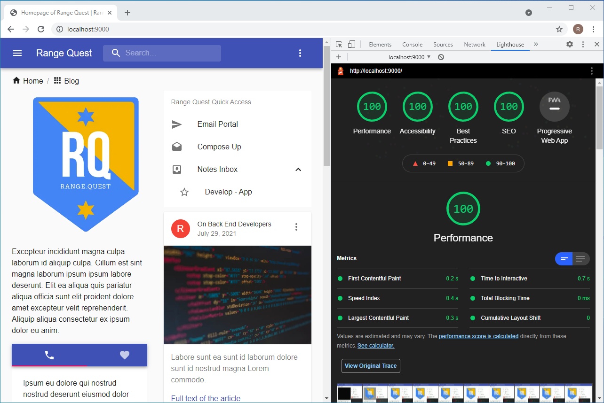
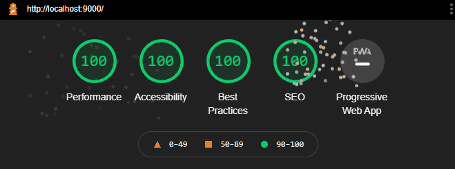
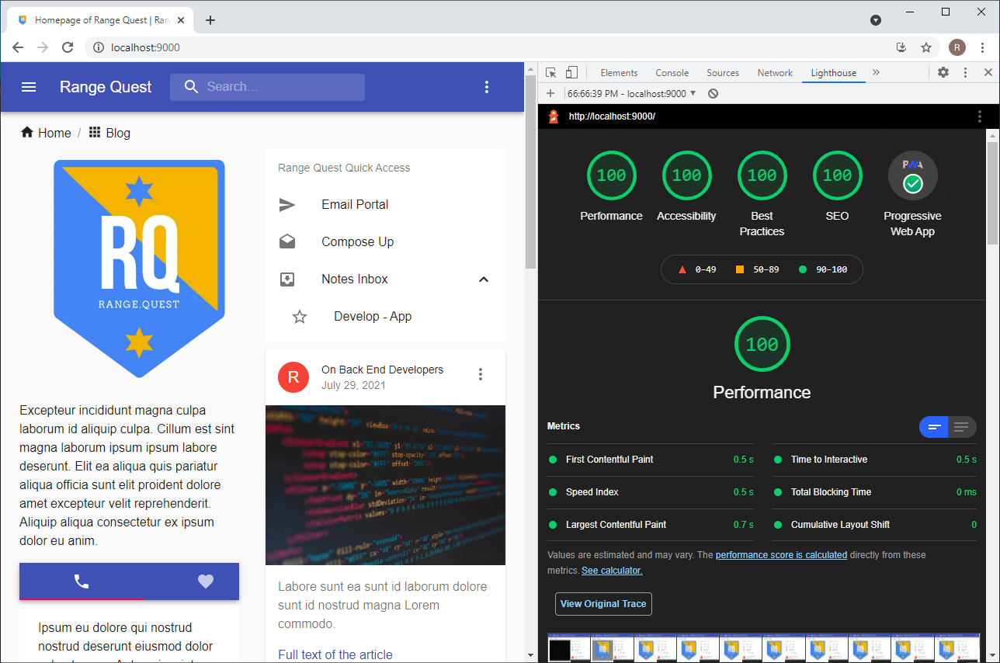
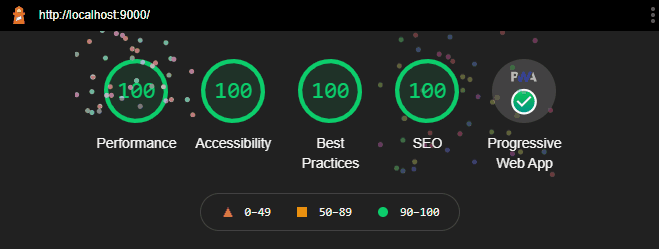

# Gatsby Progressive Web App Starter

<p align="center">
  <a href="https://gatsby-pwa-material.firebaseapp.com/">
    
  </a>
</p>
<h1 align="center">
  Gatsby Progressive Web Apps
</h1>

## 🎡 What are Progressive Web Apps

_Progressive Web Apps_ are **Websites that took all the right vitamins**.

[Read More about PWA](https://web.dev/progressive-web-apps/)

PWA checked with [Lighthouse](https://web.dev/performance-scoring/) - These checks validate the aspects of a Progressive Web App.

<p align="center">
  <a href="https://gatsby-pwa-material.firebaseapp.com/">
    
  </a>
</p>

## 🚀 Quick start

1.  **Create a Gatsby site.**

    Use the Gatsby CLI ([install instructions](https://www.gatsbyjs.com/docs/tutorial/part-0/#gatsby-cli)) to create a new site, specifying the hello-world starter.

    ```shell
    # create a new Gatsby site using the hello-world starter
    gatsby new progressive-web-app https://github.com/rangequest/firebase-gatsby.git
    ```

1.  **Start developing.**

    Navigate into your new site’s directory and start it up.

    ```shell
    cd progressive-web-app/
    gatsby develop
    ```

1.  **Open the source code and start editing!**

    Your site is now running at `http://localhost:8000`!

    _Note: You'll also see a second link: _`http://localhost:8000/___graphql`_. This is a tool you can use to experiment with querying your data. Learn more about using this tool in the [Gatsby tutorial](https://www.gatsbyjs.com/tutorial/part-five/#introducing-graphiql)._

    Open the `progressive-web-app` directory in your code editor of choice and edit `src/pages/index.js`. Save your changes and the browser will update in real time!

# Gatsby before PWA Implementation



## Before PWA



# Gatsby After PWA Implementation



## After PWA



# Features

- Google Fonts Customization
- Material UI Theme Customization
- SEO Module
- Service Worker
- Offline Page
- Installable App
- App Shortcuts
- GitHub Workflow to deploy to Firebase

# Live Demo

[🔥 Visit Site](https://gatsby-pwa-material.firebaseapp.com/)
